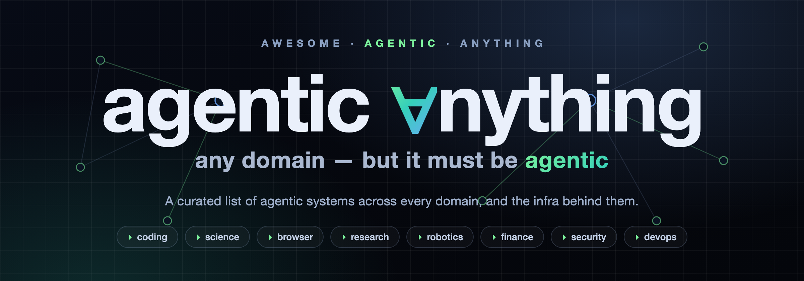

  

# Awesome Agentic *Anything*  

> A curated list of **agentic systems across every domain** — not "any AI", but *agentic* AI, wherever it shows up.

Agents are spreading into coding, science, browsing, robotics, finance, research, security, and beyond. This list tracks that spread. It collects the **systems that act autonomously toward a goal**, and the **infrastructure and research** that make them possible.

The organizing idea is simple: **any domain, but it must be agentic.** A coding assistant that plans, edits, runs tests, and iterates on its own belongs here. A single-turn chatbot does not.

> ⭐ Star counts are approximate snapshots from when each entry was last researched (2026-07) — a rough popularity signal, not a live figure.

## What Counts as "Agentic"?

We apply two layered standards.

**For a *system* to be listed** (the domain sections), it should exhibit most of:

| Trait | Meaning |
|-------|---------|
| **Autonomy** | Decides its own next step instead of following a hard-coded script. |
| **Tool use** | Calls external tools, APIs, or code execution to affect its environment. |
| **Perception–action loop** | Observes → reasons → acts → observes again, iterating toward a result. |
| **Goal-directedness** | Given a high-level goal, decomposes it into sub-tasks itself. |
| **Memory / state** | Carries state across steps and learns from outcomes. |

**We exclude:** base models (GPT, Claude, Llama), single-turn LLM apps, plain RAG Q&A, and pure DAG/workflow tools with no agentic decision-making.

**For *infrastructure* to be listed** (Building Blocks), the test is narrower: it must be **purpose-built for agents** — an agent framework, an agent protocol, an agent memory layer, an agent benchmark. A general-purpose vector database is not agentic infrastructure; an agent-to-agent protocol is.

See [CONTRIBUTING.md](CONTRIBUTING.md) before submitting.

## Contents

- [🏗️ Building Blocks & Infrastructure](#️-building-blocks--infrastructure)
  - [Frameworks & Libraries](#frameworks--libraries)
  - [Protocols & Interop](#protocols--interop)
  - [Agent-Native Interfaces & Resource Agents](#agent-native-interfaces--resource-agents)
  - [Memory & State](#memory--state)
  - [Evaluation & Benchmarks](#evaluation--benchmarks)
  - [Observability & Tracing](#observability--tracing)
- [🌐 Agentic ∀ Domains](#-agentic--domains)
  - [General-Purpose Autonomous Agents](#general-purpose-autonomous-agents)
  - [💻 Coding](#-coding)
  - [🔬 Science](#-science)
  - [🖥️ Browser & Computer Use](#️-browser--computer-use)
  - [🔎 Deep Research](#-deep-research)
  - [🤖 Robotics & Embodied](#-robotics--embodied)
  - [💰 Finance & Trading](#-finance--trading)
  - [📊 Data & Analytics](#-data--analytics)
  - [🔐 Security & Pentest](#-security--pentest)
  - [⚙️ DevOps & SRE](#️-devops--sre)
  - [🏥 Healthcare & Biomedical](#-healthcare--biomedical)
  - [⚖️ Legal](#️-legal)
  - [🎮 Gaming](#-gaming)
- [📚 Learn](#-learn)
  - [Papers & Research](#papers--research)
  - [Articles & Blogs](#articles--blogs)
  - [Tutorials & Courses](#tutorials--courses)
- [🔗 Related Awesome Lists](#-related-awesome-lists)
- [Contributing](#contributing)
- [License](#license)

---

## 🏗️ Building Blocks & Infrastructure

> These aren't agents themselves — they're the frameworks, protocols, memory layers, and benchmarks you use to **build and evaluate** agentic systems.

### Frameworks & Libraries

- [LangChain](https://github.com/langchain-ai/langchain) — The most widely used framework for chaining LLMs, tools, and agents into applications. ★~142k
- [MetaGPT](https://github.com/geekan/MetaGPT) — Multi-agent framework that assigns software-company roles (PM, architect, engineer) to build software from one line of requirements. ★~69k
- [AutoGen](https://github.com/microsoft/autogen) — Microsoft's framework for multi-agent conversational applications; its Magentic-One system orchestrates web/file/computer-use agents. ★~60k
- [CrewAI](https://github.com/crewAIInc/crewAI) — Orchestrates role-playing autonomous agents that collaborate as "crews", plus event-driven "flows". ★~56k
- [LlamaIndex](https://github.com/run-llama/llama_index) — Data framework grown into a toolkit for building agentic, data-connected LLM applications. ★~51k
- [Agno](https://github.com/agno-agi/agno) — Full-stack framework and runtime for building agents and running them as a managed service. ★~41k
- [LangGraph](https://github.com/langchain-ai/langgraph) — Low-level orchestration for stateful, long-running, graph-based agents with durable execution and human-in-the-loop. ★~37k
- [DSPy](https://github.com/stanfordnlp/dspy) — Stanford framework for *programming* (not prompting) LMs, with optimizers for modular systems including agents. ★~36k
- [smolagents](https://github.com/huggingface/smolagents) — Hugging Face's barebones library for agents that "think in code", writing actions as Python snippets. ★~28k
- [Semantic Kernel](https://github.com/microsoft/semantic-kernel) — Microsoft's model-agnostic SDK (C#/Python/Java) for building agents and multi-agent systems with plugins. ★~28k
- [OpenAI Agents SDK](https://github.com/openai/openai-agents-python) — OpenAI's lightweight, production-ready framework for multi-agent workflows with handoffs, guardrails, and tracing. ★~28k
- [AgentScope](https://github.com/modelscope/agentscope) — Framework focused on transparent, production-ready agents with events, permissions, and multi-tenancy. ★~28k
- [Mastra](https://github.com/mastra-ai/mastra) — Modern TypeScript framework for agents, workflows, evals, and observability with model routing. ★~26k
- [OpenAI Swarm](https://github.com/openai/swarm) — Educational, lightweight multi-agent orchestration library (superseded by the OpenAI Agents SDK). ★~22k
- [Google ADK](https://github.com/google/adk-python) — Google's code-first Python Agent Development Kit for building, evaluating, and deploying agents. ★~21k
- [Eliza](https://github.com/elizaOS/eliza) — TypeScript framework/OS for autonomous social and on-chain agents with an extensible plugin system. ★~19k
- [Pydantic AI](https://github.com/pydantic/pydantic-ai) — Type-safe, model-agnostic agent framework from the Pydantic team, with structured outputs and dependency injection. ★~19k
- [CAMEL](https://github.com/camel-ai/camel) — Research-oriented multi-agent framework for studying scaling laws of agent societies and data generation. ★~17k
- [Microsoft Agent Framework](https://github.com/microsoft/agent-framework) — Production framework (Python/.NET) unifying AutoGen and Semantic Kernel with graph-based workflows. ★~12k
- [PocketFlow](https://github.com/The-Pocket/PocketFlow) — Minimalist ~100-line, zero-dependency LLM framework supporting agents, workflows, and RAG. ★~11k
- [PraisonAI](https://github.com/MervinPraison/PraisonAI) — Framework for building self-improving autonomous agent "workforces" across 100+ LLMs. ★~8k
- [Julep](https://github.com/julep-ai/julep) — Framework for durable, composable agents built as crash-resumable dataflows. ★~7k
- [Strands Agents](https://github.com/strands-agents/sdk-python) — AWS-originated, model-driven SDK (Python/TS) for production agents with MCP, streaming, and multi-agent patterns. ★~7k
- [Atomic Agents](https://github.com/BrainBlend-AI/atomic-agents) — Modular, "LEGO-block" framework for agentic pipelines built on Instructor and Pydantic. ★~6k
- [Rivet](https://github.com/Ironclad/rivet) — Open-source visual IDE and TypeScript library for designing and embedding complex agent/prompt graphs. ★~5k
- [BeeAI Framework](https://github.com/i-am-bee/beeai-framework) — Python/TypeScript toolkit for production multi-agent systems with tools, memory, RAG, and workflows. ★~3k
- [Griptape](https://github.com/griptape-ai/griptape) — Modular Python framework for agents, pipelines, and workflows with drivers, tools, and memory. ★~3k

> **Visual / low-code builders** with genuine agentic nodes — workflow-first, but widely used to ship agents: [Dify](https://github.com/langgenius/dify), [Langflow](https://github.com/langflow-ai/langflow), [Flowise](https://github.com/FlowiseAI/Flowise).

### Protocols & Interop

- [Model Context Protocol (MCP)](https://github.com/modelcontextprotocol/modelcontextprotocol) — Anthropic-originated open standard for connecting agents/LLMs to tools, data, and context via a common client-server protocol. ★~8.6k
- [Agent2Agent (A2A)](https://github.com/a2aproject/A2A) — Open protocol for interoperability between opaque agents; created by Google, now governed by the Linux Foundation.
- [AGNTCY](https://github.com/agntcy) — Linux Foundation "Internet of Agents" collective (its messaging layer is SLIM, the successor to AGP).
- [Agent Network Protocol (ANP)](https://github.com/agent-network-protocol/AgentNetworkProtocol) — Open protocol for agent identity, discovery, and encrypted peer-to-peer communication. ★~1.3k
- [Agent Communication Protocol (ACP)](https://github.com/i-am-bee/acp) — BeeAI/Linux Foundation agent-messaging protocol (now archived and folded into A2A). ★~1k
- [AITP](https://github.com/nearai/aitp) — NEAR AI's Agent Interaction & Transaction Protocol for cross-trust-boundary messaging plus payments.
- [Eclipse LMOS](https://github.com/eclipse-lmos) — Eclipse Foundation project: a vendor-neutral platform and protocol for enterprise multi-agent systems.
- [Coral Protocol](https://github.com/Coral-Protocol/coral-server) — "Kubernetes for AI agents": registry, runtimes, security, and orchestration for multi-agent systems.

### Agent-Native Interfaces & Resource Agents

> A newer layer: instead of making agents parse human interfaces, these make the **resource itself agent-native** — auto-generating CLIs, skills, and callable interfaces so agents can drive any software or content reliably.

- [CLI-Anything](https://github.com/HKUDS/CLI-Anything) — HKU Data Intelligence Lab tool that auto-generates command-line interfaces so agents can control any software (GIMP, Blender, LibreOffice…) natively instead of via fragile UI automation. ★~45k
- [html-anything](https://github.com/nexu-io/html-anything) — Agentic HTML editor where your local agent writes and ships HTML across many output surfaces (deck, poster, report, social). ★~8k
- [agent-native](https://github.com/BuilderIO/agent-native) — Framework for agent-native apps: define an action once, then expose it via UI, agent, HTTP, MCP, A2A, and CLI. ★~3.7k
- [agentic-anything](https://github.com/thuqixuan/agentic-anything) — Turns any resource (websites, PDFs, videos, repos, databases) into an agent-native representation and a callable "resource agent" over chat/MCP/HTTP, with SHA-256 evidence provenance.

### Memory & State

- [mem0](https://github.com/mem0ai/mem0) — Universal memory layer adding multi-level (user/session/agent) persistent memory to agents and assistants. ★~61k
- [Graphiti](https://github.com/getzep/graphiti) — Framework for building real-time temporal knowledge graphs as agent memory, with fact-validity windows and provenance. ★~29k
- [cognee](https://github.com/topoteretes/cognee) — Open-source AI memory platform giving agents long-term memory via knowledge graphs plus vector retrieval. ★~28k
- [Letta (formerly MemGPT)](https://github.com/letta-ai/letta) — Platform for building stateful agents with self-editing long-term memory that persists across sessions. ★~24k
- [Zep](https://github.com/getzep/zep) — Agent memory platform built on a temporal knowledge graph for persistent, framework-integrated recall. ★~5k
- [MemoryScope / ReMe](https://github.com/agentscope-ai/ReMe) — ModelScope's agent memory framework (MemoryScope continued as ReMe). ★~3k
- [Memobase](https://github.com/memodb-io/memobase) — User-profile-based long-term memory maintaining evolving profiles and event timelines per user. ★~3k
- [Memary](https://github.com/kingjulio8238/Memary) — Memory layer emulating human memory (memory stream + entity knowledge over a knowledge graph) for autonomous agents. ★~3k

### Evaluation & Benchmarks

- [SWE-bench](https://github.com/SWE-bench/SWE-bench) — Benchmark of real GitHub issues that agents must resolve by generating working code patches. ★~5.4k
- [AgentBench](https://github.com/THUDM/AgentBench) — Multi-environment benchmark (OS, DB, knowledge graph, games, web) evaluating LLMs-as-agents (ICLR 2024). ★~3.6k
- [OSWorld](https://github.com/xlang-ai/OSWorld) — Benchmark for multimodal agents on open-ended tasks in real desktop OS environments (NeurIPS 2024). ★~3k
- [Terminal-Bench](https://github.com/laude-institute/terminal-bench) — Tests agents on end-to-end tasks in real sandboxed terminals (compiling, training, server setup). ★~2.5k
- [tau2-bench](https://github.com/sierra-research/tau2-bench) — Sierra's benchmark for agents in dynamic user conversations across domains, with a Gym-compatible interface. ★~1.6k
- [WebArena](https://github.com/web-arena-x/webarena) — Self-hostable realistic web environment (812 tasks) for autonomous web agents; [VisualWebArena](https://github.com/web-arena-x/visualwebarena) adds multimodal tasks. ★~1.5k
- [tau-bench](https://github.com/sierra-research/tau-bench) — Original Sierra benchmark simulating tool-using user-agent conversations (airline, retail). ★~1.3k
- [BrowserGym](https://github.com/ServiceNow/BrowserGym) — Gym environment unifying MiniWoB, WebArena, WorkArena, and custom web-agent tasks. ★~1.3k
- [AndroidWorld](https://github.com/google-research/android_world) — 116 tasks across 20 real Android apps on a live emulator, with dynamic task variation. ★~0.8k
- [TheAgentCompany](https://github.com/TheAgentCompany/TheAgentCompany) — Measures agents on realistic professional tasks inside a simulated software company. ★~0.7k
- [ClawBench](https://github.com/TIGER-AI-Lab/ClawBench) — Benchmark for browser agents on 283 everyday tasks across live websites, with isolated execution, request interception, and five-layer run traces. ★~0.5k
- [AgentBoard](https://github.com/hkust-nlp/AgentBoard) — Analytical evaluation with fine-grained progress metrics across 9 agent tasks (NeurIPS 2024 oral). ★~0.4k
- [GAIA](https://huggingface.co/datasets/gaia-benchmark/GAIA) — 450+ real-world questions requiring reasoning, multimodality, browsing, and tool use (hosted on Hugging Face).

### Observability & Tracing

- [Langfuse](https://github.com/langfuse/langfuse) — Open-source LLM/agent engineering platform for tracing, prompt management, and evaluation. ★~31k
- [Phoenix (Arize)](https://github.com/Arize-ai/phoenix) — Open-source, OpenTelemetry-based observability for tracing, evaluating, and debugging LLM/agent apps. ★~11k
- [Helicone](https://github.com/Helicone/helicone) — Open-source AI gateway and observability platform with one-line logging, tracing, and cost/latency metrics. ★~6k
- [AgentOps](https://github.com/AgentOps-AI/agentops) — Observability SDK purpose-built for agents: session replays, execution graphs, and cost tracking. ★~6k

---

## 🌐 Agentic ∀ Domains

> The core of "anything": agentic systems, organized by the domain they act in. Each must satisfy the agentic standard above.

### General-Purpose Autonomous Agents

- [AutoGPT](https://github.com/Significant-Gravitas/AutoGPT) — The project that popularized autonomous, goal-driven GPT agents; now a platform for building them.
- [Suna / Kortix](https://github.com/kortix-ai/suna) — Open-source generalist agent with browser automation, file management, and research tools built in. ★~20k
- [BabyAGI](https://github.com/yoheinakajima/babyagi) — Minimal task-driven autonomous agent that spawns and prioritizes its own to-do list.
- [SuperAGI](https://github.com/TransformerOptimus/SuperAGI) — Dev-first framework to build, manage, and run autonomous agents with a GUI.
- [AgentGPT](https://github.com/reworkd/AgentGPT) — Assemble, configure, and deploy autonomous agents in the browser.
- [ChatDev](https://github.com/OpenBMB/ChatDev) — Virtual software company of communicative agents that design, code, and test together.

### 💻 Coding

- [Claude Code](https://github.com/anthropics/claude-code) — Anthropic's agentic CLI that reads your codebase, edits across files, runs tests, and handles git workflows. ★~135k
- [Gemini CLI](https://github.com/google-gemini/gemini-cli) — Google's open-source terminal agent for Gemini, with tool use and codebase editing. ★~104k
- [OpenAI Codex CLI](https://github.com/openai/codex) — OpenAI's lightweight, Rust-based terminal coding agent that plans, edits, and runs commands. ★~98k
- [OpenHands](https://github.com/OpenHands/OpenHands) — Open platform (formerly OpenDevin) where agents write code, run commands, and browse the web; a leading open SWE-bench performer. ★~76k
- [Cline](https://github.com/cline/cline) — Open-source autonomous coding agent for VS Code/JetBrains that edits files, runs commands, and uses the browser with step approval. ★~61k
- [gpt-engineer](https://github.com/AntonOsika/gpt-engineer) — Pioneering CLI that builds whole projects from a natural-language spec. ★~55k
- [Goose](https://github.com/block/goose) — Block's open-source, on-machine agent that installs, executes, edits, and tests via MCP extensions. ★~51k
- [Aider](https://github.com/Aider-AI/aider) — Terminal AI pair programmer that edits code across a git repo with a codebase map and auto-commits. ★~47k
- [Continue](https://github.com/continuedev/continue) — Open-source assistant with chat, multi-file edit, agent mode, and CI/headless agents. ★~35k
- [Roo Code](https://github.com/RooCodeInc/Roo-Code) — Open-source VS Code agent with role-based modes (Architect/Code/Debug) that edit files and run commands. ★~24k
- [Void](https://github.com/voideditor/void) — Open-source VS Code fork / Cursor alternative with agentic chat and codebase-wide edits. ★~22k
- [Kilo Code](https://github.com/Kilo-Org/kilocode) — Open-source agentic engineering platform for VS Code/JetBrains/CLI with 500+ models and BYOK. ★~20k
- [bolt.diy](https://github.com/stackblitz-labs/bolt.diy) — StackBlitz's in-browser agent that prompts, runs, edits, and deploys full-stack apps in a WebContainer. ★~19k
- [SWE-agent](https://github.com/SWE-agent/SWE-agent) — Princeton/Stanford agent that autonomously resolves GitHub issues (and CTF/cybersecurity tasks); influential SWE-bench baseline. ★~18.5k
- [Plandex](https://github.com/plandex-ai/plandex) — Plan-first terminal agent for large multi-file tasks with a big context window and diff-review sandbox. ★~15k
- [Codebuff](https://github.com/CodebuffAI/codebuff) — Open-source multi-agent terminal coder coordinating specialized sub-agents to edit your codebase. ★~7k
- [gptme](https://github.com/gptme/gptme) — Early (2023) terminal agent that writes code, runs the shell, and browses the web; can run persistently. ★~4k
- [Refact.ai](https://github.com/smallcloudai/refact) — Open-source, local-first IDE agent that plans, executes, and iterates end-to-end. ★~2.4k
- [RA.Aid](https://github.com/ai-christianson/RA.Aid) — LangGraph-based agent combining research, planning, and multi-step implementation. ★~2.2k
- [Cursor](https://cursor.com) — AI-native IDE (Anysphere) whose Agent Mode does autonomous multi-file edits and runs commands. *(closed-source)*
- [Devin](https://devin.ai) — Cognition's autonomous "AI software engineer" that plans, writes, tests, and ships in a cloud VM. *(closed-source)*
- [Windsurf](https://windsurf.com) — Agentic IDE (formerly Codeium) whose Cascade agent reads the full codebase and runs multi-step tasks. *(closed-source)*

### 🔬 Science

- [The AI Scientist](https://github.com/SakanaAI/AI-Scientist) — Sakana AI's end-to-end system that generates ideas, runs ML experiments, and writes full papers autonomously. ★~14k
- [PaperQA2](https://github.com/Future-House/paper-qa) — FutureHouse's high-accuracy RAG agent for question-answering over scientific papers. ★~9k
- [The AI Scientist-v2](https://github.com/SakanaAI/AI-Scientist-v2) — Template-free successor using agentic tree search; produced the first fully AI-generated paper to pass workshop peer review. ★~7k
- [Agent Laboratory](https://github.com/SamuelSchmidgall/AgentLaboratory) — Multi-agent workflow running literature review, experimentation, and report writing around a human's research idea. ★~6k
- [Biomni](https://github.com/snap-stanford/Biomni) — Stanford's general-purpose biomedical agent that plans and executes research tasks (CRISPR screens, scRNA-seq) via code. ★~3.5k
- [ChemCrow](https://github.com/ur-whitelab/chemcrow-public) — LLM chemistry agent wrapping 18 expert tools to plan and execute synthesis, drug discovery, and materials tasks. ★~0.9k
- [Virtual Lab](https://github.com/zou-group/virtual-lab) — Stanford "PI + scientist agents" framework that designed SARS-CoV-2 nanobodies (published in Nature). ★~0.7k
- [SciAgents](https://github.com/lamm-mit/SciAgentsDiscovery) — MIT multi-agent system reasoning over knowledge graphs to discover hypotheses in bio-inspired materials. ★~0.6k
- [Robin](https://github.com/Future-House/robin) — FutureHouse multi-agent system that autonomously generated hypotheses and proposed a dry-AMD drug candidate. ★~0.6k
- [Coscientist](https://github.com/gomesgroup/coscientist) — CMU GPT-4 agent that autonomously designed and ran real chemistry experiments on robotic hardware (Nature). ★~0.2k
- [Aviary](https://github.com/Future-House/aviary) — FutureHouse gymnasium for training language agents on real scientific tasks (literature, DNA, protein design). ★~0.3k
- [Google AI co-scientist](https://research.google/blog/accelerating-scientific-breakthroughs-with-an-ai-co-scientist/) — Gemini-based multi-agent system that generates, debates, and ranks novel research hypotheses. *(no public repo)*
- [Agents4Science](https://agents4science.stanford.edu/) — Stanford-run open conference where AI systems serve as required primary authors and reviewers. *(initiative)*

### 🖥️ Browser & Computer Use

**Browser**

- [browser-use](https://github.com/browser-use/browser-use) — Widely-used framework that lets LLM agents drive a real browser via DOM + vision. ★~105k
- [Playwright MCP](https://github.com/microsoft/playwright-mcp) — Microsoft's MCP server exposing Playwright browser control to any LLM via accessibility snapshots. ★~35k
- [Stagehand](https://github.com/browserbase/stagehand) — Browserbase's TypeScript SDK mixing natural-language actions with deterministic Playwright code. ★~24k
- [Skyvern](https://github.com/Skyvern-AI/skyvern) — Uses a swarm of agents plus computer vision to plan and execute browser workflows, with a no-code builder. ★~22k
- [Nanobrowser](https://github.com/nanobrowser/nanobrowser) — Chrome extension running multi-agent web automation with your own API key; an Operator alternative. ★~13k
- [Steel Browser](https://github.com/steel-dev/steel-browser) — Open-source headless-browser API/sandbox giving agents managed browser sessions. ★~7k
- [LaVague](https://github.com/lavague-ai/LaVague) — "Large Action Model" framework for web agents that translate objectives into Selenium/Playwright actions. ★~6k
- [Notte](https://github.com/nottelabs/notte) — Framework and browser-infra for building web agents, with session, auth, and credential-vault primitives. ★~2k
- [Agent-E](https://github.com/EmergenceAI/Agent-E) — Emergence AI's web-automation agent built on AutoGen, using DOM distillation to act on pages. ★~1.2k

**Computer / OS / GUI & Mobile**

- [Open Interpreter](https://github.com/OpenInterpreter/open-interpreter) — Runs LLM-generated code locally to control your computer (files, shell, apps). ★~64k
- [UI-TARS-desktop](https://github.com/bytedance/UI-TARS-desktop) — ByteDance desktop app and agent stack giving a native GUI agent control over local/remote computer and browser. ★~38k
- [Anthropic Computer Use](https://github.com/anthropics/claude-quickstarts) — Reference computer-use demo (containerized desktop) showing Claude controlling mouse/keyboard/screen. ★~17k
- [Self-Operating Computer](https://github.com/OthersideAI/self-operating-computer) — Framework letting a multimodal model view the screen and drive mouse/keyboard to operate a computer. ★~10k
- [Mobile-Agent](https://github.com/X-PLUG/MobileAgent) — Alibaba's family of multimodal GUI agents that plan, reflect, and automate mobile/PC/browser tasks. ★~9k
- [DroidRun](https://github.com/droidrun/droidrun) — LLM-agnostic framework to control Android/iOS devices via natural language (tap, swipe, type, plan). ★~9k
- [AppAgent](https://github.com/TencentQQGYLab/AppAgent) — Tencent's multimodal agent that learns to operate smartphone apps by observing screenshots and tapping. ★~7k

### 🔎 Deep Research

- [STORM / Co-STORM](https://github.com/stanford-oval/storm) — Stanford system that researches a topic via simulated expert interviews and writes a cited, Wikipedia-style report. ★~30k
- [GPT Researcher](https://github.com/assafelovic/gpt-researcher) — Autonomous agent that runs multi-step web and local research and produces detailed, cited reports. ★~28k
- [deep-research (dzhng)](https://github.com/dzhng/deep-research) — Minimal (<500-line) iterative deep-research agent combining search, scraping, and LLMs. ★~19k
- [Open Deep Research (LangChain)](https://github.com/langchain-ai/open_deep_research) — Configurable, fully open deep-research agent working across many providers, search tools, and MCP servers. ★~12k
- [Local Deep Researcher (LangChain)](https://github.com/langchain-ai/local-deep-researcher) — Fully local iterative web-research and report-writing assistant using Ollama/LMStudio models. ★~9k
- [Local Deep Research (LearningCircuit)](https://github.com/LearningCircuit/local-deep-research) — Privacy-focused research assistant across 10+ search engines including arXiv and PubMed. ★~9k
- [DeepSearcher (Zilliz)](https://github.com/zilliztech/deep-searcher) — Deep-research alternative that reasons and searches over private data using LLMs plus vector databases. ★~8k
- [Open Deep Research (nickscamara)](https://github.com/nickscamara/open-deep-research) — Next.js app replicating OpenAI Deep Research using Firecrawl plus a reasoning model. ★~6k
- [node-DeepResearch (Jina)](https://github.com/jina-ai/node-DeepResearch) — Iterative search-read-reason loop that keeps digging until it answers or hits a token budget. ★~5k
- [WebThinker](https://github.com/RUC-NLPIR/WebThinker) — Framework letting large reasoning models autonomously search, browse, and write reports mid-reasoning (NeurIPS 2025). ★~1.5k
- [OpenAI Deep Research](https://openai.com/index/introducing-deep-research/) — ChatGPT's agentic feature that browses and synthesizes hundreds of sources into a cited report. *(closed-source)*

### 🤖 Robotics & Embodied

- [LeRobot](https://github.com/huggingface/lerobot) — Hugging Face's robotics stack shipping VLA and imitation/RL policies that drive real robots. ★~26k
- [Voyager](https://github.com/MineDojo/Voyager) — GPT-4-powered lifelong-learning agent that autonomously explores Minecraft, writing and reusing skill code. ★~7k
- [OpenVLA](https://github.com/openvla/openvla) — Open-source vision-language-action model for goal-directed robotic manipulation. ★~7k
- [Eureka](https://github.com/eureka-research/Eureka) — LLM agent that writes and evolutionarily refines RL reward functions, beating human-designed rewards on most tasks. ★~3k
- [RoboAgent](https://github.com/robopen/roboagent) — Multi-task manipulation agent trained on the RoboSet dataset, evaluated on real Franka arms. ★~0.4k

### 💰 Finance & Trading

- [ai-hedge-fund](https://github.com/virattt/ai-hedge-fund) — Educational multi-agent hedge-fund sim with investor personas plus risk/portfolio managers collaborating on trades. ★~62k
- [FinRobot](https://github.com/AI4Finance-Foundation/FinRobot) — Multi-agent platform (orchestrator + role-based + debate agents) for automated financial analysis and valuation. ★~8k
- [TradingAgents](https://github.com/TauricResearch/TradingAgents) — Multi-agent trading framework with analyst, bull/bear researcher, trader, and risk agents that debate decisions.

### 📊 Data & Analytics

- [Vanna](https://github.com/vanna-ai/vanna) — Text-to-SQL framework using agentic retrieval to chat with SQL databases. ★~24k
- [PandasAI](https://github.com/sinaptik-ai/pandas-ai) — Natural-language data-analysis library with an Agent mode over dataframes and databases. ★~24k
- [WrenAI](https://github.com/Canner/WrenAI) — Agent-driven GenBI engine turning natural language into governed SQL, charts, and dashboards across 20+ sources. ★~16k
- [Dataherald](https://github.com/Dataherald/dataherald) — Natural-language-to-SQL engine for relational data, with engine, admin console, and Slackbot. ★~3.6k

### 🔐 Security & Pentest

- [PentestGPT](https://github.com/GreyDGL/PentestGPT) — Autonomous penetration-testing agent (USENIX Security 2024) with a multi-stage pipeline driving tool execution. ★~14k
- [CAI (Cybersecurity AI)](https://github.com/aliasrobotics/cai) — Framework for building ReAct-style offensive/defensive security agents with swarm/hierarchical patterns. ★~9.5k
- [Vulnhuntr](https://github.com/protectai/vulnhuntr) — LLM agent that traces call chains to autonomously find remotely exploitable vulns in Python code. ★~2.7k
- [hackingBuddyGPT](https://github.com/ipa-lab/hackingBuddyGPT) — Reusable components for building autonomous LLM pentest agents (LLM calls, logging, command execution). ★~1.2k

### ⚙️ DevOps & SRE

- [K8sGPT](https://github.com/k8sgpt-ai/k8sgpt) — Scans Kubernetes clusters, diagnoses issues, and explains them; analyzer-driven with AI backends. ★~8k
- [kagent](https://github.com/kagent-dev/kagent) — Kubernetes-native framework for building/deploying agents as custom resources (prompt + tools + LLM). ★~3.3k
- [HolmesGPT](https://github.com/robusta-dev/holmesgpt) — CNCF-sandbox agent that runs an agentic loop over live observability data to root-cause incidents. ★~2.9k

### 🏥 Healthcare & Biomedical

- [TxAgent](https://github.com/mims-harvard/TxAgent) — Therapeutic-reasoning agent doing multi-step reasoning over a 211-tool toolbox for treatment recommendations. ★~0.6k
- [MedAgents](https://github.com/gersteinlab/MedAgents) — Multi-disciplinary LLM agent-collaboration framework for medical QA reasoning (ACL 2024 Findings). ★~0.4k

> See also [Biomni](https://github.com/snap-stanford/Biomni) and [Robin](https://github.com/Future-House/robin) under [Science](#-science).

### ⚖️ Legal

- [OpenContracts](https://github.com/Open-Source-Legal/OpenContracts) — Document-intelligence platform with agents that search, annotate, and reason over citation graphs, plus an MCP server. ★~1.4k

### 🎮 Gaming

- [Cradle](https://github.com/BAAI-Agents/Cradle) — General Computer Control agent that plays games (RDR2, Stardew Valley, Cities: Skylines) from screenshots via reasoning and skill curation. ★~2.6k

---

## 📚 Learn

### Papers & Research

- [ReAct: Synergizing Reasoning and Acting in Language Models](https://arxiv.org/abs/2210.03629) — Interleaves chain-of-thought reasoning with tool/action steps; the canonical agent loop.
- [Reflexion: Language Agents with Verbal Reinforcement Learning](https://arxiv.org/abs/2303.11366) — Agents self-reflect on failures in natural language to improve on retries.
- [Toolformer: Language Models Can Teach Themselves to Use Tools](https://arxiv.org/abs/2302.04761) — LLM learns which APIs to call and how, self-supervised.
- [Generative Agents: Interactive Simulacra of Human Behavior](https://arxiv.org/abs/2304.03442) — 25 memory-driven agents simulating believable behavior in a sandbox town.
- [Tree of Thoughts: Deliberate Problem Solving with LLMs](https://arxiv.org/abs/2305.10601) — Search over a tree of reasoning steps with lookahead and backtracking.
- [Voyager: An Open-Ended Embodied Agent with LLMs](https://arxiv.org/abs/2305.16291) — Lifelong-learning Minecraft agent that builds a reusable skill library.
- [HuggingGPT: Solving AI Tasks with ChatGPT and its Friends](https://arxiv.org/abs/2303.17580) — LLM as controller orchestrating specialist models to complete tasks.
- [MRKL Systems](https://arxiv.org/abs/2205.00445) — Early neuro-symbolic architecture routing queries to expert modules/tools.
- [Plan-and-Solve Prompting](https://arxiv.org/abs/2305.04091) — Devise a plan first, then execute subtasks, improving zero-shot reasoning.
- [ReWOO: Decoupling Reasoning from Observations](https://arxiv.org/abs/2305.18323) — Separates planning from tool calls to cut token cost and redundant steps.
- [Self-Refine: Iterative Refinement with Self-Feedback](https://arxiv.org/abs/2303.17651) — One LLM generates, critiques, and revises its own output in a loop.
- [Cognitive Architectures for Language Agents (CoALA)](https://arxiv.org/abs/2309.02427) — Framework organizing memory, action space, and decision-making for language agents.
- [A Survey on LLM-based Autonomous Agents](https://arxiv.org/abs/2308.11432) — Widely-cited survey with a unified construction/application/evaluation framework (Wang et al.).
- [The Rise and Potential of LLM-Based Agents: A Survey](https://arxiv.org/abs/2309.07864) — Broad brain–perception–action framing (Xi et al., Fudan).
- [LLM-based Multi-Agents: A Survey of Progress and Challenges](https://arxiv.org/abs/2402.01680) — Survey of multi-agent frameworks, communication, and world simulation (IJCAI 2024).

### Articles & Blogs

- [LLM Powered Autonomous Agents](https://lilianweng.github.io/posts/2023-06-23-agent/) — Lilian Weng's reference explainer: agents as LLM + planning + memory + tool use.
- [Building Effective Agents](https://www.anthropic.com/engineering/building-effective-agents) — Anthropic distinguishes workflows from agents and catalogs practical composable patterns.
- [Agents](https://huyenchip.com/2025/01/07/agents.html) — Chip Huyen's deep dive on tools, planning, and agent failure modes.
- [Don't Build Multi-Agents](https://cognition.com/blog/dont-build-multi-agents) — Cognition argues single-threaded, context-sharing agents beat fragile parallel sub-agents.
- [A Practical Guide to Building Agents](https://cdn.openai.com/business-guides-and-resources/a-practical-guide-to-building-agents.pdf) — OpenAI's guide to agent design, orchestration, and guardrails (PDF).
- [Agents Whitepaper](https://www.kaggle.com/whitepaper-agents) — Google's model/orchestration/tools breakdown of agent architecture.
- [Four AI Agentic Workflow Design Patterns](https://www.deeplearning.ai/the-batch/how-agents-can-improve-llm-performance/) — Andrew Ng on Reflection, Tool Use, Planning, and Multi-Agent Collaboration.

### Tutorials & Courses

- [Hugging Face AI Agents Course](https://huggingface.co/learn/agents-course/en/unit0/introduction) — Free, certified course building agents with smolagents, LangChain, and LlamaIndex, capped by a GAIA challenge.
- [Introduction to LangGraph](https://academy.langchain.com/courses/intro-to-langgraph) — LangChain Academy's free course on graph-based workflows, memory, and human-in-the-loop agents.
- [AI Agentic Design Patterns with AutoGen](https://www.deeplearning.ai/courses/ai-agentic-design-patterns-with-autogen) — DeepLearning.AI short course on multi-agent systems, taught by AutoGen's creators.
- [Functions, Tools and Agents with LangChain](https://www.deeplearning.ai/courses/functions-tools-agents-langchain/) — DeepLearning.AI short course on tool calling and agents.
- [Anthropic Courses](https://github.com/anthropics/courses) — Educational notebooks covering API fundamentals, tool use, and prompt engineering.
- [Agents Towards Production](https://github.com/NirDiamant/agents-towards-production) — Code-first tutorials on production agent stacks: orchestration, memory, observability, deployment, security.

---

## 🔗 Related Awesome Lists

Great neighbors — go here for depth in a specific slice:

- [punkpeye/awesome-mcp-servers](https://github.com/punkpeye/awesome-mcp-servers) — The definitive collection of Model Context Protocol servers. ★~91k
- [e2b-dev/awesome-ai-agents](https://github.com/e2b-dev/awesome-ai-agents) — Large curated list of autonomous AI agents and projects. ★~29k
- [hyp1231/awesome-llm-powered-agent](https://github.com/hyp1231/awesome-llm-powered-agent) — Papers, repos, and blogs on LLM-powered agents. ★~2.3k
- [AGI-Edgerunners/LLM-Agents-Papers](https://github.com/AGI-Edgerunners/LLM-Agents-Papers) — Research paper index for LLM-based agents by technique and application. ★~2.3k
- [kaushikb11/awesome-llm-agents](https://github.com/kaushikb11/awesome-llm-agents) — Curated list of LLM agent frameworks with star/fork metadata. ★~1.5k
- [Jenqyang/Awesome-AI-Agents](https://github.com/Jenqyang/Awesome-AI-Agents) — Autonomous, multi-agent, and simulation projects powered by LLMs.
- [tsinghua-fib-lab/Awesome-AI-Scientists](https://github.com/tsinghua-fib-lab/Awesome-AI-Scientists) — Companion to Tsinghua's "AI Scientists" survey, cataloging autonomous-research systems.
- [kyrolabs/awesome-agents](https://github.com/kyrolabs/awesome-agents) — Curated open-source tools and frameworks for building AI agents.

---

## Contributing

Contributions are welcome! Please read the [contribution guidelines](CONTRIBUTING.md) first — especially the "What counts as agentic" bar. In short: open a PR that keeps entries in the right layer, one line each, with an honest one-sentence description.

## License

To the extent possible under law, the contributors have waived all copyright and related rights to this work. See [LICENSE](LICENSE).
